# petcare
全国大学生嵌入式大赛

https://github.com/user-attachments/assets/839aec75-f5ec-41f9-bf42-e57152bc6812

# 作品名称  
**基于RK3588异构协同的宠物智能监控与陪伴机器人**  

队伍名；姓名1；姓名2；姓名3；指导老师  

---

## 摘要  
本作品旨在应对宠物独自在家时产生的分离焦虑及其可能引发的危险行为。系统构建于RK3588高性能异构计算平台之上，融合多核CPU、GPU、NPU等协同计算资源，支持端侧多模态感知与本地AI推理，具备高效、低延迟的处理能力。

整体架构由设备端、云端和用户端组成。设备端基于ROS2框架，通过3D深度相机采集RGB与深度图像，采用YOLOv8进行宠物目标检测与行为识别，结合轮式底盘、地图构建与目标跟随策略，实现自主移动监管与智能陪伴。系统内嵌本地部署的大语言模型Qwen2-VL-2B，可在离线状态下完成图文分析与行为判定，极大提升私密性与响应效率。行为异常时，系统将自动保存图像、调用大模型生成文字描述；同时搭建了内网穿透与中转服务器，可将消息推送至用户端。用户端支持Web网页或APP登陆远程查看宠物动态，并可下发语音安抚或驱赶指令，由设备端本地TTS模块实时播报，形成闭环交互。相比传统方案，本系统在保障隐私安全的同时，实现了智能感知、语义理解、行为判断与互动反馈的端到端整合，适用于家庭场景下的宠物看护、陪伴与行为数据管理，具备良好的实用性与可扩展性。

---

## 第一部分 作品概述  

### 1.1 功能与特性  
本系统集成监控、分析与交互于一体，主要特性包括：  
-  **边缘计算平台搭建：**选用RK3588高性能异构计算平台，集成CPU+GPU+NPU资源，支持本地AI模型推理，满足系统对目标检测、图文生成和语音合成等多任务并行处理需求。   
- **感知识别与机器人移动控制：**使用3D深度相机采集RGB+深度图像；引入YOLOv8模型完成宠物目标识别与定位，同时基于ROS2控制轮式底盘实现宠物跟随。
- **本地语义理解与图文生成：**在设备端本地部署Qwen2-VL-2B大模型，支持离线接收识别结果与图像输入，输出自然语言描述（如"猫在沙发上打滚"、"狗在翻垃圾桶"）并生成结构话数据于后续记录与播报。
- **语音交互与用户反馈：**搭建内网穿透及中转服务器，联网即可进行远程消息推送；通过sherpa-onnx实现TTS本地语音合成，用户端可通过Web界面或APP实时查看宠物并远程下发播报内容。
- **多种交互模式支持：**系统支持灵活的消息推送机制（如不同的消息推送触发机制；是否附带图片；不同的语音播报机制等）满足不同用户需求与网络状况。   
- 系统通过RK3588的多核异构算力，实现高效AI推理与实时控制，具备出色的边缘计算能力，适应多变家庭环境。  

### 1.2 应用领域  
本系统广泛适用于以下场景：   
- **城市独居宠物家庭：**解决宠物孤独、焦虑、无监管等问题。   
- **宠物行为研究：**提供行为数据日志与可视化分析，辅助动物行为学研究。   
- **智能家居集成：**作为智能终端接入家庭IoT平台，实现跨设备联动（如与门禁、灯控、音响联动）。   
- **宠物店或寄养中心：**用于实时监管宠物状态、提升服务智能化水平。
- **延展应用：**可拓展用于盲人辅助、婴儿监护、老人独居等其他视觉语义场景。  

### 1.3 主要技术特点  
- **异构计算平台（RK3588）：**集成A76/A55多核CPU、NPU与GPU，实现AI边缘推理与实时控制协同等多任务并发处理。   
- **YOLOv8+ROS2架构：**模块化设计，支持图像采集、识别、控制与导航子系统高效协作。实现宠物精准定位、轨迹跟踪。
- **图文识别与自然语言生成：**本地部署Qwen2-VL-2B大模型，将视觉信息转化为自然语言描述，提升用户对宠物行为的理解效率。
- **语音合成与音响互动：**使用sherpa-onnx实现TTS语音合成，与宠物建立"拟人化"沟通桥梁。
- **多端日志同步与远程交互：**设备-云-用户三端联动，实现宠物生活可视化与远程控制。  

### 1.4 主要性能指标  
| 指标项                     | 数值或描述         |
|----------------------------|--------------------|
| 目标检测精度（YOLOv8）     | mAP@0.5 ≈ 88%      |
| 移动速度控制误差           | ±3 cm/s            |
| 图文描述延迟               | ≤6秒               |
| TTS语音合成响应            | ≤2秒               |
| 图片上传速度               | 受网络信号影响     |
| 消息推送响应               | ≤2秒               |

### 1.5 主要创新点  
- **利用RK3588异构能力，NPU负责相对复杂的推理（如大模型及YOLOv8），利用CPU处理通信及语音合成等问题。实现多任务并行处理，提升系统响应速度。
- **首创"宠物图文描述"功能，结合AI视觉与自然语言生成，使人宠互动更直观。且本地部署大模型，可离线使用，防止信息外泄，更适应家庭应用场景。
- **搭建了内网穿透及消息中转服务器，可跨网络通信、远程访问开发板，便于调试，同时实现信息的多端联动与远程推送，实现多模态感知（视觉+语音）与动态反馈。  

### 1.6 设计流程  
- **需求分析：**明确宠物监控、自主跟随、远程互动等核心功能，确定性能指标（如检测精度、响应延迟）。
- **硬件选型与系统搭建：**基于RK3588构建硬件平台，接入深度相机、轮式底盘与扬声器等设备，完成电路连接与机械组装。
- **ROS2功能包开发：**实现图像采集、目标检测、大模型调用、远程交互等节点。
- **模块集成：**构建本地图文分析模块，对接大模型接口；实现设备-云-用户端通信协议。
- **系统集成测试：**部署至实际场景中测试系统稳定性与有效性。  

---

## 第二部分 系统组成及功能说明  

### 2.1 整体介绍  
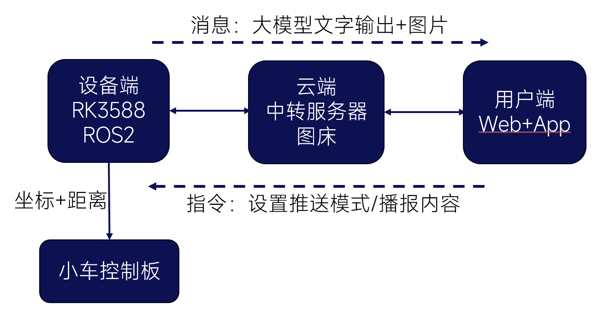  
> **本系统功能流程包括：**  
> 1. 启动系统，相机与大模型初始化；  
> 2. 启动YOLOv8实时检测与坐标发送模块，控制底盘跟随；  
> 3. 启动大模型图文推理，将图像转化为自然语言描述；  
> 4. 用户端设置交互模式，决定是否推送、附图、播报；  
> 5. 通过服务器将消息与图像远程推送至用户端；  
> 6. 设备端接收指令并使用扬声器完成语音播报；  
> 7. 网络异常时自动降级为仅文字推送或本地语音播报，保障信息传递连续性  

### 2.2 硬件系统介绍  
#### 2.2.1 硬件整体介绍  
> 硬件系统围绕RK3588主控平台构建，集成以下关键部件：  
> - RK3588开发板：负责图像识别、运行ROS/AI模型、通信于任务调度等核心计算任务；  
> - 深度相机：实现RGB+深度图像采集与空间定位；  
> - 轮式运动底盘：配备电机控制器，用于机器人自主移动与导航；  
> - 扬声器模块：用于本地语音合成TTS语音输出；  
> - 无线通信模块（WiFi/4G）：保障设备与云端及用户端通信。  
>  
> 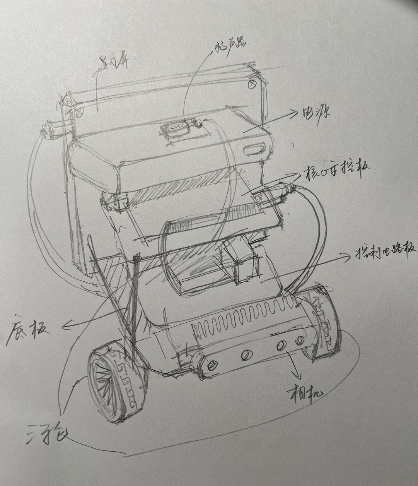  

#### 2.2.2 机械设计介绍  
> 机器人采用模块化底盘设计，具备以下特性：  
> - 轮式全向运动结构：支持直线、旋转、斜向多种移动方式；  
>  
> 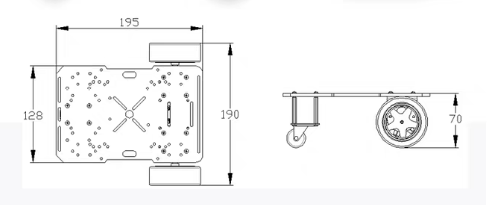  
>  
> - 摄像头俯仰角调节机构：便于宠物不同高度场景监控；  
>  
> 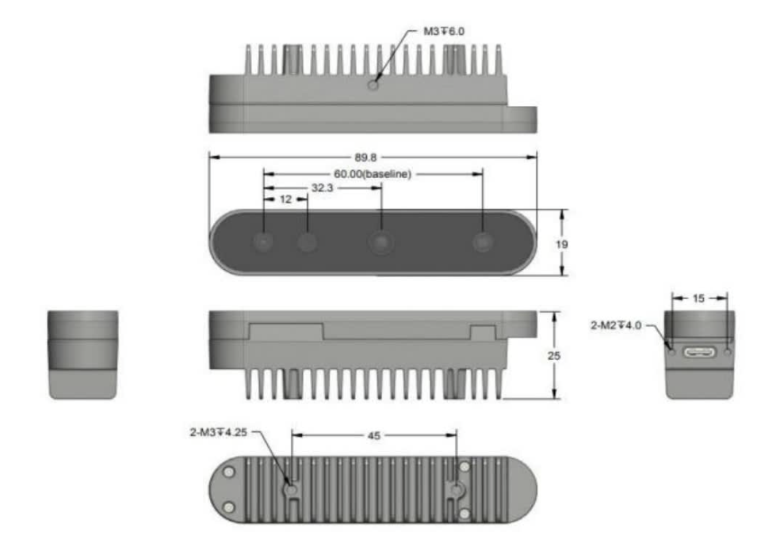  
> 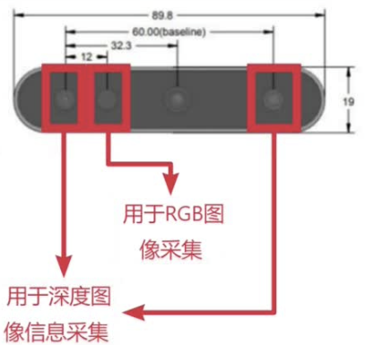  
>  
> - 结构紧凑、适应家庭环境：可在沙发、桌椅、门口等复杂环境移动。  

#### 2.2.3 电路各模块介绍  
> 主控板：ELF2 RK3588  
>  
> 各关键模块以以下方式连接：  
> - 主控板与相机：通过USB3.0接口高速传输图像；  
> - 主控板与底盘控制器：通过UART通信下发速度与转向控制指令；  
> - 自制PCB底盘控制板：  
>  
>   
>  
> - TTS音频输出模块：连接音响系统，通过3.5mm音频口或I2S数字接口；  

### 2.3 软件系统介绍  
#### 2.3.1 软件整体介绍  
> 软件采用ROS2+Python为核心架构，分为三个层次：  
> - 感知层：图像采集、目标识别、下位机通信；  
>  
>   
>  
> - 决策层：大模型推理、行为判断、任务调度；  
>  
>   
>  
> - 交互层：图像上传、云端通信、TTS播报。  
>  
>   
>   

#### 2.3.2 软件各模块介绍  
> 系统的软件部分采用模块化设计，基于ROS2架构，整体包括图像采集、识别推理、行为判断、串口控制、语音播报、图像上传与远程交互等多个功能节点。以下为关键模块的功能流程和接口说明：  
>  
> 1. **图像与深度同步采集模块（YoloDepthFusionNode）**  
>    - 功能：同时订阅RGB与深度图像话题 `/ascamera/camera_publisher/rgb0/image` 和 `/ascamera/camera_publisher/depth0/image_raw`，并利用ApproximateTimeSynchronizer进行时间同步处理，保证图像对齐。  
>    - 输入：sensor_msgs.msg.Image（RGB）、sensor_msgs.msg.Image（Depth）  
>    - 输出：OpenCV格式的图像对  
>    - 关键函数：synced_callback()  
>  
> 2. **YOLOv8目标识别模块**  
>    - 功能：加载并推理yolov8.rknn模型，对RGB图像进行目标检测，提取边界框、类别和置信度。  
>    - 核心函数：model.inference()、yolov8_post_process()  
>    - 关键类别：支持cat、dog等宠物类识别，通过传参设置感兴趣类别。  
>  
> 3. **深度融合与行为定位模块**  
>    - 功能：获取目标检测框中心点的深度值（毫米级），实现宠物三维空间定位。  
>    - 输出字段：  
>        - center_x, center_y：图像坐标系下的像素中心点  
>        - depth_value：对应的深度值，单位为mm  
>    - 特殊处理：深度值为0时输出提醒（表示无效）  
>  
> 4. **串口通信控制模块**  
>    - 功能：将目标中心坐标及深度值格式化为串口指令（例如X0123Y0240Z003500），通过UART接口发送至移动底盘或外部控制器。  
>    - 串口配置：默认端口为/dev/ttyS9，波特率为115200  
>    - 错误处理：通信失败时自动重连并重试  
>  
> 5. **可视化与调试模块**  
>    - 功能：将识别结果在图像中叠加显示，辅助调试  
>        - 显示边界框、目标类别、中心点和深度数值  
>    - 工具：OpenCV的imshow函数，每帧刷新  
>  
> 6. **图像上传与Web消息推送模块（联合调用另一个节点）**  
>    - 功能：将图像上传至图床（如IMGBB、IMGURL），并通过HTTP接口推送识别结果及图片URL至用户消息平台。  
>    - 接口：HTTP POST http://tencent.wishzone.top:8385/message  
>    - 结构字段：title, message, imageURL, priority等  
>  
> 7. **TTS语音播报模块（调用独立Speaker模块）**  
>    - 功能：本地播报识别结果或用户指令，适配离线场景。  
>    - 依赖：sherpa-onnx实现的TTS后端  
>    - 调用方式：跨线程安全调度或同步播放  
>  
> 8. **模式控制与WebSocket远程互动模块**  
>    - 功能：通过WebSocket实时接收来自远程控制端的消息，支持以下操作：  
>        - title="播报"：立即播报指定内容  
>        - title="托管"：设置默认播报内容  
>        - title="模式"：切换异常监控与反馈模式（共四种）  
>    - 特点：具备断线重连、线程守护等稳定机制  
>  
> 9. **大模型推理接口（统一调用模块）**  
>    - 功能：将图像转base64后与任务Prompt一起发送给本地部署的大模型进行视觉行为分析（是否异常、生成描述）  
>    - 接口：HTTP POST http://localhost:8090/v1/chat/completions  
>    - 输出：JSON格式 {"content": "描述", "conclusion": "Normal/Abnormal"}  
>  
> 该系统通过YOLO检测与深度估计模块实现目标识别与空间定位，并以TTS播报、串口控制与远程消息推送等手段形成完整闭环控制链，具备可靠性高、部署灵活、响应实时等优点，能够适应复杂室内家庭场景。  

---

## 第三部分 完成情况及性能参数  

### 3.1 整体介绍  
系统整体已完成软硬件集成部署，并在实际家庭环境中成功运行，具备稳定性与实用性。设备端采用RK3588平台实现全流程本地处理，包含视觉识别、语义生成与语音播报功能，不依赖云端，保障响应速度。  

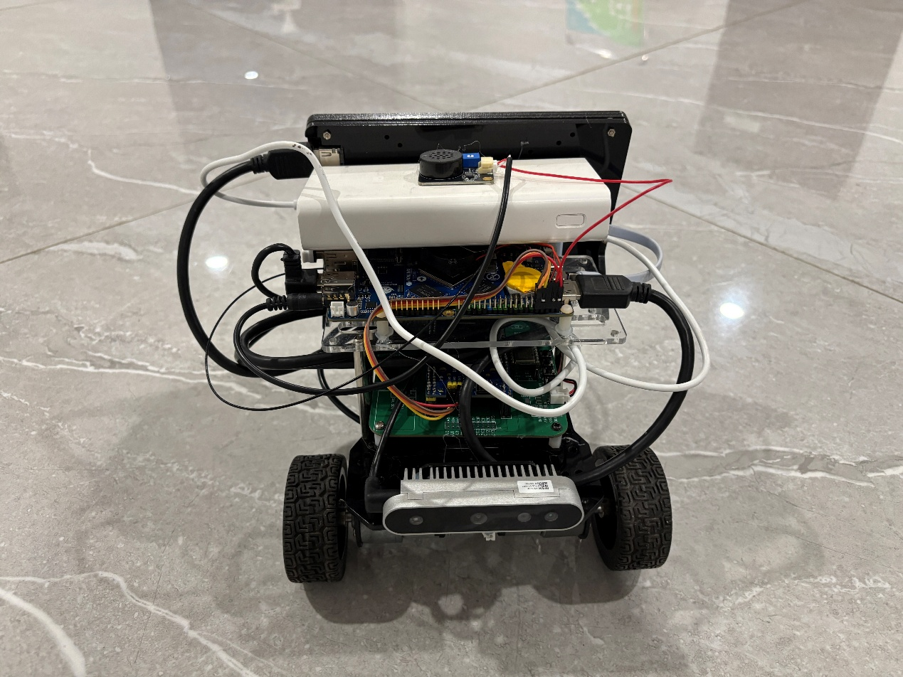  
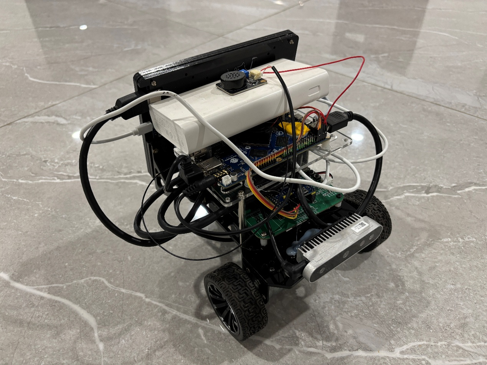  
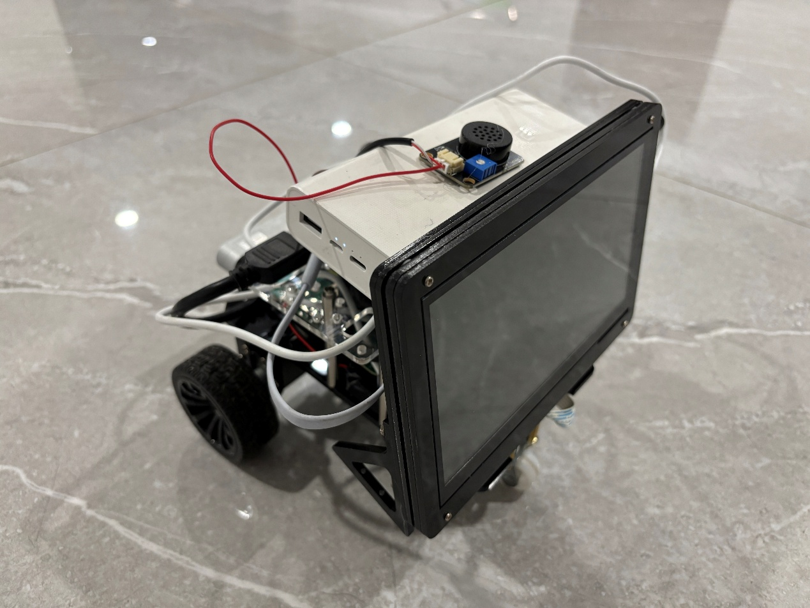  

### 3.2 工程成果  
#### 3.2.1 机械成果  
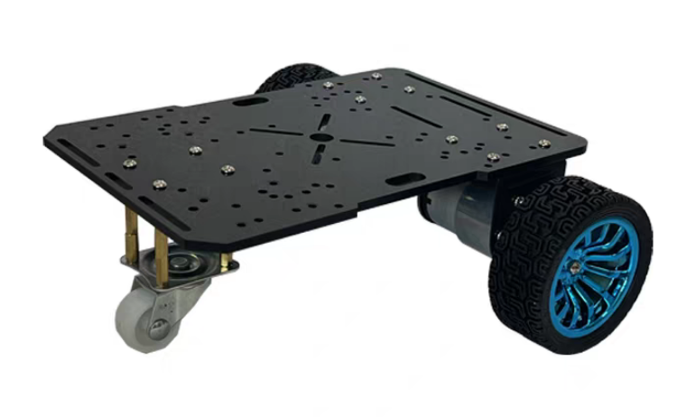  

#### 3.2.2 电路成果  
  
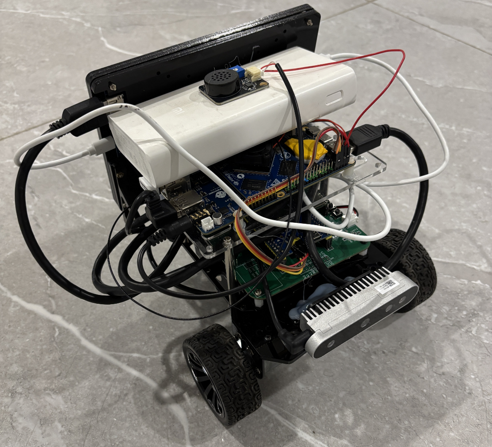  

#### 3.2.3 软件成果  
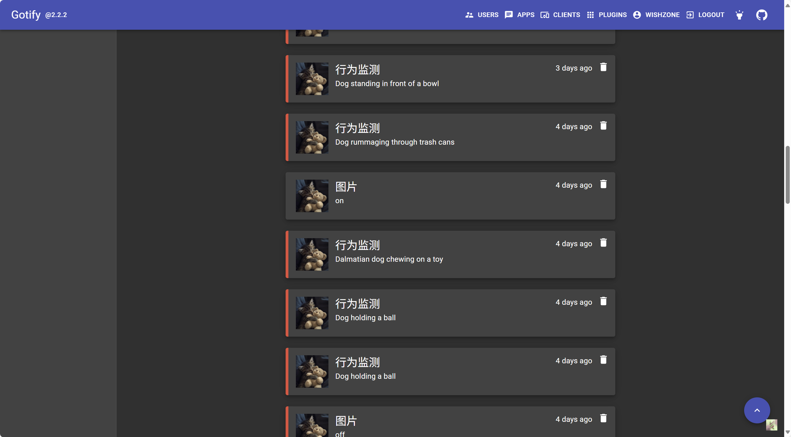  
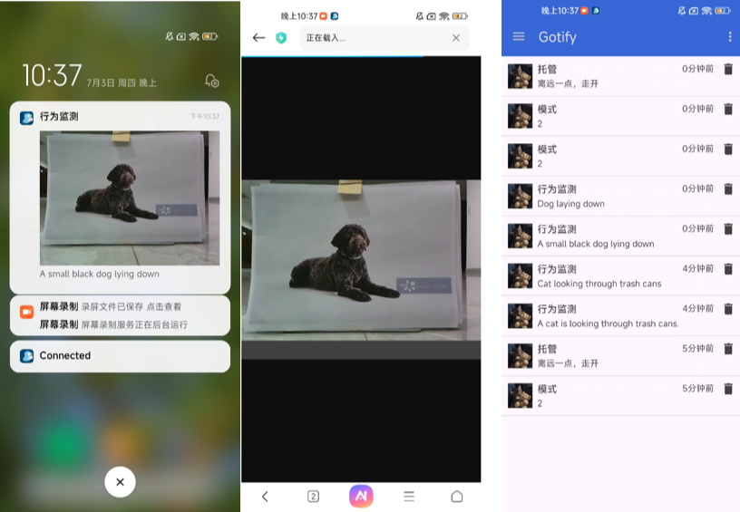

### 3.3 特性成果  
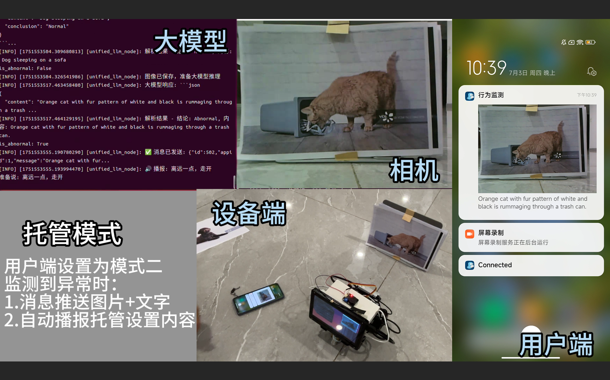  

---

## 第四部分 总结  

### 4.1 可扩展之处  
本系统以RK3588异构计算平台为核心，已实现完整的图像采集、目标识别、深度估计、行为分析与多端交互功能，具备高度的模块化与可拓展性。未来在保持系统稳定运行的基础上，还可围绕下列方向进行功能拓展与性能增强：  

- **多目标识别与个体追踪：**引入目标重识别（ReID）与ID跟踪机制，在检测多个宠物的基础上，实现对不同个体的独立行为分析、活动日志归档与历史行为趋势分析，适应多宠物家庭场景。  
- **家居环境联动控制：**系统可进一步接入家庭IoT设备，如智能门锁、红外传感器、灯控系统等。当宠物靠近特定区域或出现异常行为时，可自动联动响应，例如亮灯、抓拍、锁门等，实现更智能的家居场景控制。  
- **语音交互与远程控制拓展：**在现有Web交互与语音播报功能基础上，可加入语音识别前端（ASR），让用户通过语音下达指令，实现自然语言交互，如"查看猫现在在哪里"、"让机器人靠近猫播报"等，提升人机交互体验。  
- **行为建模与健康评估：**结合长时间行为采集与统计分析技术，建立宠物个体的日常行为模型，通过机器学习识别异常趋势（如持续不动、异常进食频率等），形成行为-健康风险预警机制。  
- **导航系统精度优化：**在移动控制模块中引入多传感器融合SLAM（同步定位与地图构建）、视觉惯性导航（VIO）等方法，提升机器人室内定位精度和路径规划能力，支持复杂家庭环境下的稳定移动与目标跟随。  

系统整体架构高度模块化，各功能节点松耦合设计，便于后续在不同应用场景下进行裁剪、组合与部署，具备良好的工程维护性、跨平台移植性和产业化潜力。  

### 4.2 心得体会  
本项目的设计与实施过程中，我们从最初的需求分析出发，全面锻炼了从系统架构搭建到功能实现、从软硬件协同到多线程通信的完整工程开发能力。  

本系统集成了深度图像识别、目标检测、大模型推理、TTS语音播报、WebSocket远程交互、串口硬件控制等多个技术环节，是一次复杂但极具挑战性的项目实践。我们特别关注实际运行场景中可能出现的问题，如图像延迟、通信失败、推理速度瓶颈等，针对性地设计了图像本地缓存、异常行为自动降级处理、网络异常语音播报等鲁棒性机制，提升系统可靠性。  

在模型部分，我们采用本地部署的Qwen2-VL视觉语言模型替代传统云端API，在保障用户隐私的同时极大降低了响应时延，使边缘智能设备在无网络环境下依然能独立完成分析与反馈任务。  

此外，在底盘控制与深度融合方面，我们通过YOLO目标检测与同步深度图处理结合，精准获取宠物空间位置并实时下发串口控制指令，初步实现了"视觉引导式宠物跟随"功能，为后续开发智能移动交互系统奠定了基础。  

整个项目周期中，我们团队分工明确，积极沟通，高效完成各阶段任务，在技术研发、逻辑梳理、测试验证及文档整理等方面均有显著提升。通过该系统的开发，我们不仅积累了丰富的边缘AI系统设计经验，也对智能陪伴机器人未来的产品化路径有了更清晰的认识。  

---

## 第五部分 参考文献  
\[1\] Liu, Z., Wu, B., Yuan, Y., et al. EdgeYOLO: An Edge-Real-Time Object Detector. arXiv preprint arXiv:2302.07483, 2023.  
\[2\] Dai, L., Huang, Y., Chen, C., et al. An Advanced Approach to Object Detection and Tracking in Robotics Using YOLOv8 and LiDAR Data Fusion. Electronics, 2024, 13(12), 2250.  
\[3\] Li, T., Zhang, H., & Zhou, F. RealNet: Combining Optimized Object Detection with Information Fusion Depth Estimation Co‑Design Method on IoT. arXiv preprint arXiv:2204.11216, 2022.  
\[4\] Jin, Y., Zhang, Q., & Chen, R. Lightweight Domestic Pig Behavior Detection Based on YOLOv8. Applied Sciences, 2024, 15(11), 6340.  
\[5\] Pico-Valencia, P., & Holgado-Terriza, J.A. The Internet of Things Empowering the Internet of Pets: An Overview. Sensors, 2025.  
\[6\] Ultralytics. Monitoring Animal Behavior Using YOLOv8. Ultralytics Blog. https://www.ultralytics.com/blog/monitoring-animal-behavior-using-ultralytics-yolov8  
\[7\] GitHub. SMART-TRACK: ROS2-based RGBD Object Tracker. https://github.com/mzahana/SMART-TRACK  
